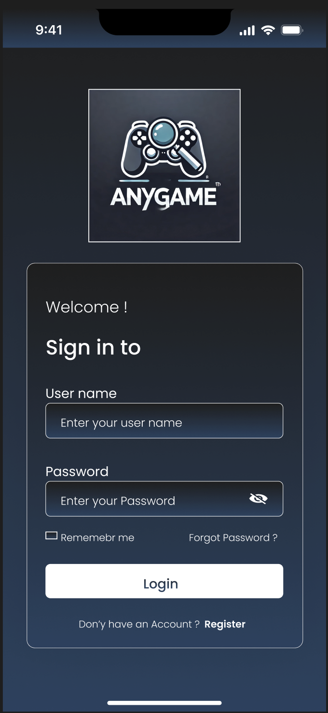
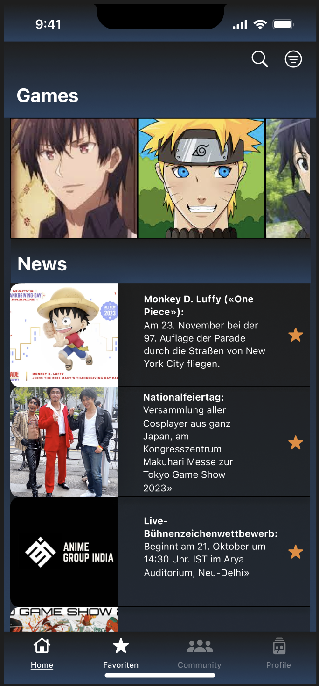
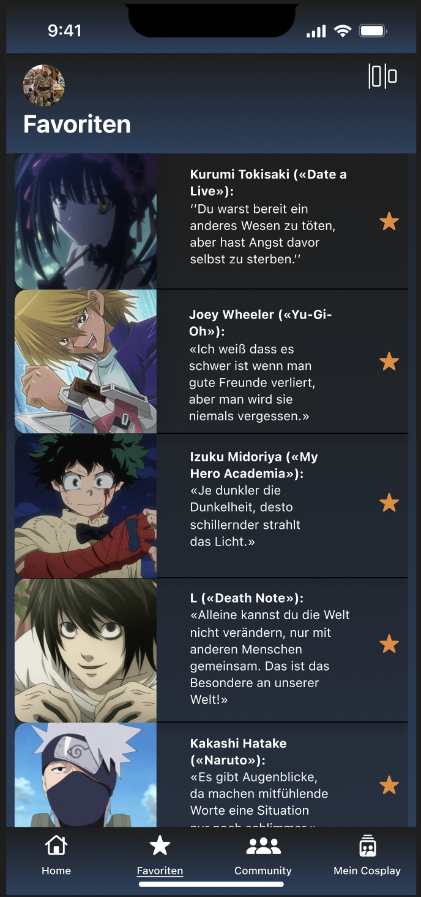
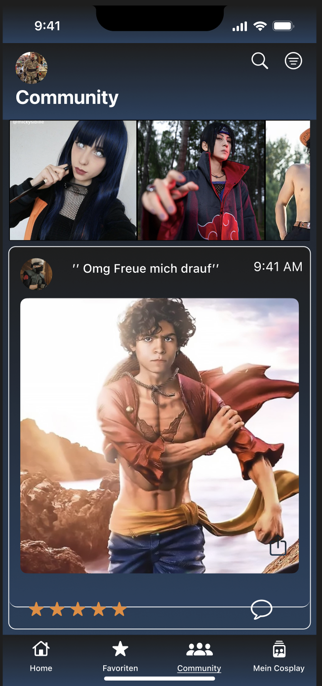

# AnyGame

Dein Tor zur Gaming-Welt – Immer aktuell, immer vernetzt

AnyGame bietet eine umfassende Plattform für Gaming-Enthusiasten, um die neuesten Nachrichten und Updates zu ihren Lieblingsspielen zu erhalten. Mit einer benutzerfreundlichen Oberfläche und einer Vielzahl an Funktionen, die die Interaktion und Personalisierung ermöglichen, hebt sich AnyGame von anderen Apps ab. 

Egal ob du einfach nur informiert bleiben oder deine Lieblingsspiele im Auge behalten möchtest, AnyGame bietet dir alles, was du brauchst, an einem Ort.

## Geplantes Design

  
  
  
  

## Features
Hier kommen alle geplanten Features der App rein mit dem Status, ob es bereits umgesetzt wurde.

- [ ] **LoginView**: Ermöglicht Benutzern die Anmeldung über Firebase-Authentifizierung.
- [ ] **RegisterView**: Ermöglicht Benutzern die Registrierung über Firebase-Authentifizierung.
- [ ] **GameView**: Zeigt eine Übersicht aller Spiele-News in einer Liste und im oberen Bereich einige hervorgehobene Spiele, durch die horizontal gescrollt werden kann. Außerdem enthält sie eine Such- und Filterfunktion.
- [ ] **GameDetailView**: Zeigt detaillierte Informationen zu einem ausgewählten Spiel an, einschließlich Nachrichten und Beschreibungen, und ermöglicht es, das Spiel zu favorisieren.
- [ ] **FavoriteGameView**: Zeigt die favorisierten Spiele an und ermöglicht das Löschen von Favoriten.
- [ ] **CommunityView**: Ermöglicht Benutzern, sich untereinander auszutauschen, Kommentare zu Spielen und Nachrichten zu hinterlassen und Diskussionen zu führen.
- [ ] **ProfileView**: Zeigt das Profil des Benutzers an, ermöglicht das Bearbeiten persönlicher Informationen und das Ausloggen.

## Technischer Aufbau

#### Projektaufbau
Das Projekt folgt dem MVVM (Model-View-ViewModel) Architekturprinzip. Die Hauptordnerstruktur umfasst:

- **Models**: Enthält die Datenmodelle.
- **Views**: Beinhaltet die SwiftUI-Views.
- **ViewModels**: Enthält die Logik und Bindungen zwischen Modellen und Views.
- **Services**: Beinhaltet die Integrationen wie Firebase.

#### Datenspeicherung
- **Firebase**: Für die Authentifizierung und Speicherung von Benutzerinformationen.
- **Core Data**: Für das lokale Speichern von favorisierten Spielen und anderen persistenten Daten.

#### API Calls
- **RAWG API**: Für das Abrufen von Spielinformationen und Nachrichten.

#### 3rd-Party Frameworks
- **Firebase Authentication**: Für Benutzeranmeldung und -registrierung.
- **Firebase Firestore**: Für die Speicherung und Verwaltung der Spieldaten und Benutzerinformationen.
- **SwiftUI**: Für die Gestaltung der Benutzeroberfläche.

## Ausblick
In Zukunft möchte ich weitere Features für die Community-Funktion integrieren, die es den Benutzern ermöglichen, sich noch besser auszutauschen und zu vernetzen. Dazu gehören erweiterte Diskussionsforen, Direktnachrichten zwischen Benutzern und Events, bei denen Benutzer ihre Erfahrungen teilen können.

 
